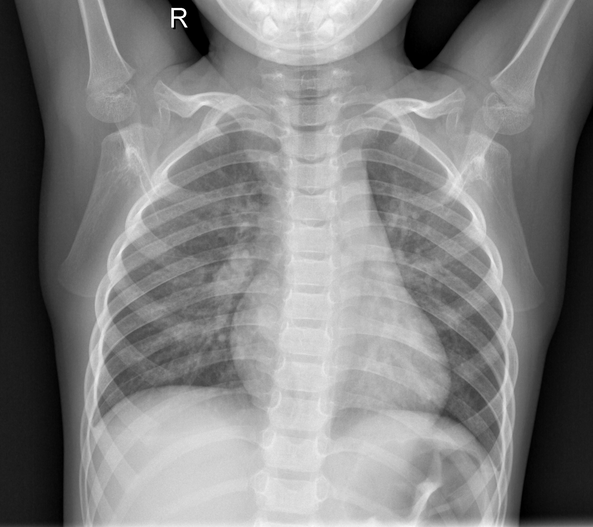
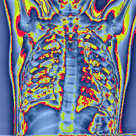
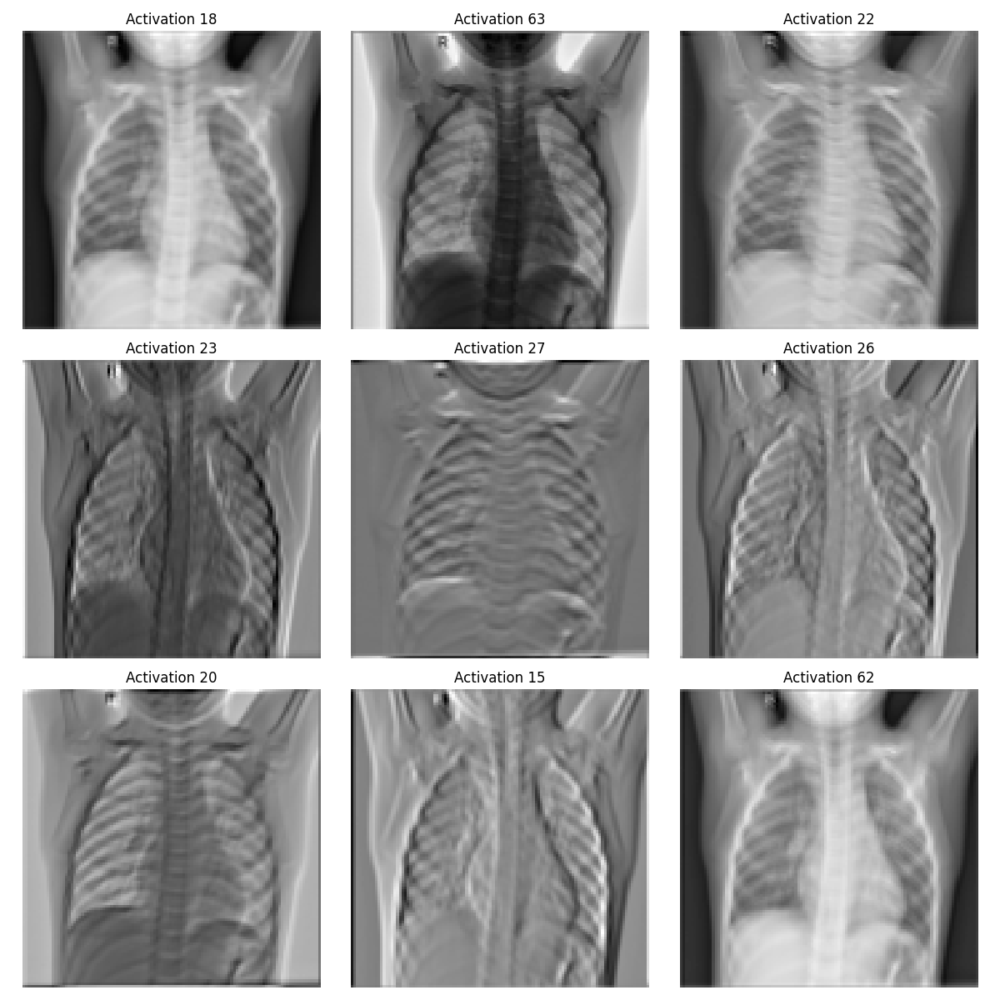
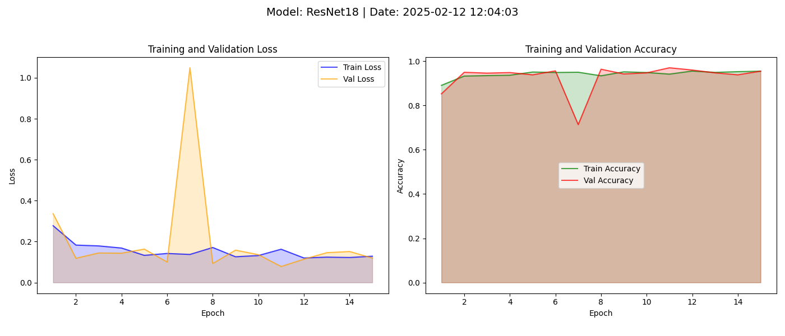

# 🩺 Pneumonia Detection using ResNet18

Welcome to the **Pneumonia Detection Project**! This repository showcases how to build a deep learning pipeline for classifying chest X-ray images using **ResNet18**. We preprocess the images, apply data augmentation techniques, and train a neural network to distinguish between **NORMAL** and **PNEUMONIA** cases. 📈

## 📁 Project Structure

The project is organized as follows:

```
x-ray-pneuomnia-diagnosis/
├── data/                 # Dataset directory containing chest X-ray images
│   ├── chest_xray/
│       ├── train/        # Training data, containing NORMAL and PNEUMONIA subfolders (empty folders in the repository)
│       ├── val/          # Validation data, containing NORMAL and PNEUMONIA subfolders (empty folders in the repository)
│       └── test/         # Test data, containing NORMAL and PNEUMONIA subfolders (empty folders in the repository)
├── example_imgs/         # Example images for README
├── output/               # Directory for output files (models, metrics, plots, reports)
│   ├── best_model.pth
│   ├── metrics.csv
│   ├── performance_plot.png
│   ├── report.json
│   └── report.md
├── src/                  # Source code directory
│   ├── dataset.py        # Data loading and preprocessing
│   ├── model.py          # Model definition (ResNet18)
│   └── utils.py          # Utility functions (metrics, logging, plotting)
├── LICENSE               # MIT project license
├── README.md             # Project documentation
├── requirements.txt      # Python dependencies
├── main.py               # Main script for training and evaluation
└── example_imgs.py       # Script for generating example images for the README
```

## 📖 Table of Contents
1. [Dataset and Preprocessing](#dataset-and-preprocessing)
2. [ResNet18 Architecture](#resnet18-architecture)
3. [Training and Evaluation](#training-and-evaluation)
4. [Results and Metrics](#results-and-metrics)
5. [How to Run the Project](#how-to-run-the-project)
6. [References](#references)

---

## 📊 Dataset and Preprocessing

The dataset used in this project is sourced from the [Chest X-Ray Images (Pneumonia)](https://www.kaggle.com/paultimothymooney/chest-xray-pneumonia). It contains X-ray images categorized into:
- **NORMAL**: Images of healthy lungs
- **PNEUMONIA**: Images indicating pneumonia infection

### 🔄 Data Preprocessing and Augmentation

The dataset contains X-ray images in grayscale format (1 channel), which represent the intensity of light. However, since we are using ResNet18 pre-trained on ImageNet (which expects 3-channel RGB images), we convert the grayscale images to RGB by replicating the intensity across the three channels. This does not add new information but allows us to leverage the pre-trained model.

We preprocess the images to ensure they are suitable for training the ResNet18 model. Below are the steps:

1. **Resizing**: All images are resized to `224x224` pixels.
2. **Data Augmentation** (applied only to training data):
   - Random horizontal flips
   - Random rotations up to 30°
   - Brightness, contrast, and saturation adjustments
   - Random affine transformations with scaling and translation
3. **Normalization**: Images are normalized using mean and standard deviation values of the ImageNet dataset.

🖼️ **Original Image:**  


🖼️ **Preprocessed Image:**  


---

## 🧠 ResNet18 Architecture

ResNet18 is a convolutional neural network (CNN) with 18 layers, known for its "skip connections" or "residual connections" that help avoid the vanishing gradient problem in deep networks. 

In this project, we fine-tune a pre-trained ResNet18 model from ImageNet by modifying the final fully connected layer to classify between two categories: **NORMAL** and **PNEUMONIA**.

### 🔧 Key Modifications:
- **Dropout Layer**: Added to reduce overfitting.
- **Final Layer**: Changed to a linear layer with 2 output units (binary classification).

🔍 **Visualization of a convolutional layer:**  


---

## 🚀 Training and Evaluation

The model is trained using the following configuration:
- **Loss Function**: CrossEntropyLoss
- **Optimizer**: Adam with a learning rate of 0.001
- **Scheduler**: ReduceLROnPlateau to reduce the learning rate when the validation loss plateaus
- **Early Stopping**: Stops training if validation loss does not improve for 5 consecutive epochs.

### 🔄 Training Loop:
- The training and validation metrics (loss and accuracy) are logged at each epoch.
- The model with the best validation loss is saved as `best_model.pth`.

---

## 📈 Results and Metrics

### Performance Metrics
The following table shows the classification performance on the test set:

|    CLASS     |   precision |   recall |   f1-score |    support |
|:-------------|------------:|---------:|-----------:|-----------:|
| NORMAL       |    0.987261 | 0.662393 |   0.792839 | 234        |
| PNEUMONIA    |    0.830835 | 0.994872 |   0.905484 | 390        |
| accuracy     |    0.870192 | 0.870192 |   0.870192 |   0.870192 |
| macro avg    |    0.909048 | 0.828632 |   0.849162 | 624        |
| weighted avg |    0.889495 | 0.870192 |   0.863242 | 624        |

### 📊 Graphical Results
We plot the loss and accuracy for both training and validation phases over 15 epochs:

📊 

---

## 🛠️ How to Run the Project

### Prerequisites
- Python 3.8+
- PyTorch
- torchvision
- pandas
- matplotlib
- scikit-learn

### Installation
1. Clone this repository:
    ```bash
    git clone https://github.com/FranRguezCer/your-repository.git
    cd your-repository
    ```
2. Install the required packages:
    ```bash
    pip install -r requirements.txt
    ```

### 🏃 Running the Training Script
Execute the `main.py` script to train the model and evaluate its performance:
```bash
python main.py
```

### 📂 Output
- `best_model.pth`: The best-performing model saved during training.
- `output/metrics.csv`: Logs of training and validation metrics.
- `output/performance_plot.png`: Visualization of training and validation performance.
- `output/report.json`: Detailed classification report in JSON format.
- `output/report.md`: Classification report in Markdown format.

---

## 📚 References
- [PyTorch Documentation](https://pytorch.org/docs/stable/index.html)
- [ResNet Paper: Deep Residual Learning for Image Recognition](https://arxiv.org/abs/1512.03385)

---

## 📧 Contact
For any questions or suggestions, feel free to reach out or open an issue in the repository. 😊

---

## 🛡️ License
This project is licensed under the [MIT License](LICENSE). You are free to use, modify, and distribute this project in accordance with the terms of the license.